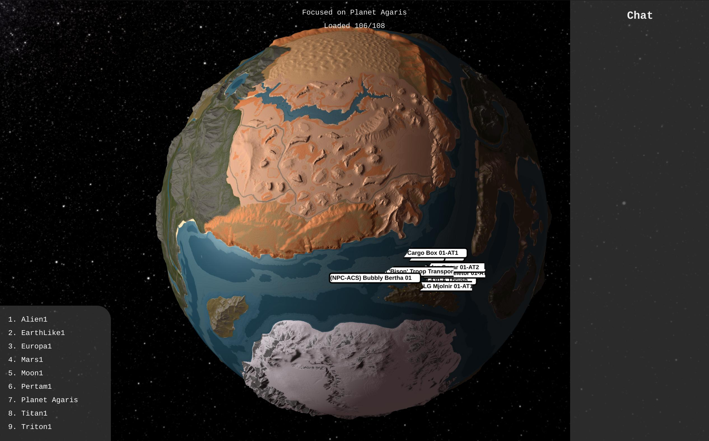

# SpaceLab Viewer (WIP)

This is WAY under testing and development. But it does generate some nice maps.

REQUIRES SpaceLab Plugin on Torch (To be released yet)



# Generating material textures from game assets

Check `tools/surfacegen.py`. In the start of the file you will find these lines:

```python
planetData = "assets/Triton.sbc"
planetName = "Triton"
baseAssetPath = "assets/Triton/"
```

Set `planetData` to the SBC file containing the planet description XML, `planetName` to the name of the planet (as per the XML file) and `baseAssetPath` to the folder where texture files like `up.png`, `down.png` are.


# Building UI

Requires nodejs and npm

```bash
cd webui
npm install
npm run build
```

The contents of `dist` folder is WebUI built.

# Building the Golang Backend

```bash
# Linux / MacOSX
go build -o agarismap
# Windows
go build -o agarismap.exe
```

# License

The source-code itself is under MIT License. The assets under webui/public/img should be dealt as proprietary.

Most of them were generated using tools on folder `tools` using real game data. They should be dealt as proprietary unless otherwise explicit.

Credits:

* Vanilla Planets (EarthLike, Alien, Moon, Mars, Europa, Triton, Titan, Pertam): [Keen Software House](https://github.com/KeenSoftwareHouse)
* Agaris: [CptArthur](https://github.com/CptArthur) [Agaris with Roads Mod](https://steamcommunity.com/sharedfiles/filedetails/?id=2567339915)
* Milkway Skybox: [Milkway Skybox](https://steamcommunity.com/sharedfiles/filedetails/?id=670718659)

# CHANGES TO GAME DATA

Some gamedata is used for generating the required textures. Here are the list of changes I had to do.

Weirdly, I had to swap the front and left images, and rotate 180 degrees the up image.